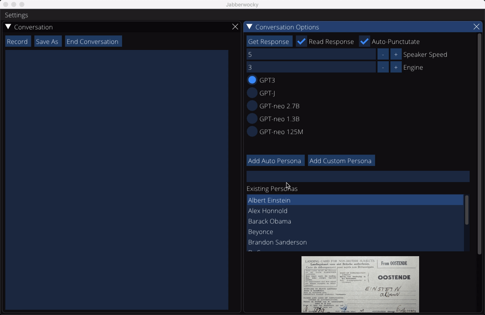

# Jabberwocky


# Project Description
A GUI providing an audio interface to GPT3. We support conversations with most public figures and provide a number of other pre-built tasks including:
- Summarization
- Explain like I'm 5
- Translation
- How To (step by step instructions for performing everyday tasks)
- Writing Style Analysis
- MMA Fight Analysis and Prediction
- Explain machine learning concepts in simple language
    - Generate ML paper abstracts

### Examples

In conversation mode, you can chat with a number of pre-defined personas or add new ones:



In task mode, you can ask GPT3 to perform a number pre-defined tasks. Written and spoken input are both supported. By default, GPT3's response is both displayed in writing and read aloud.


Transcripts of responses from a subset of non-conversation tasks can be found in the `data/completion` directory.

### Project Members
* Harrison Mamin

### Repo Structure
```
jabberwocky/
├── data         # Raw and processed data. Actual files are excluded from github.
├── notes        # Miscellaneous notes stored as raw text files.
├── notebooks    # Jupyter notebooks for experimentation and exploratory analysis.
├── reports      # Markdown reports (performance reports, blog posts, etc.)
├── bin          # Executable scripts to be run from the project root directory.
├── lib          # Python package. Code can be imported in analysis notebooks, py scripts, etc.
└── services     # Serve model predictions through a Flask/FastAPI app.
```

---
Start of auto-generated file data.<br/>Last updated: 2021-09-04 13:15:33

<table border="1" class="dataframe">
  <thead>
    <tr style="text-align: right;">
      <th>File</th>
      <th>Summary</th>
      <th>Code Cell Count</th>
      <th>Markdown Cell Count</th>
      <th>Last Modified</th>
      <th>Size</th>
    </tr>
  </thead>
  <tbody>
    <tr>
      <td>TEMPLATE.ipynb</td>
      <td>`# TODO: write summary`</td>
      <td>3</td>
      <td>1</td>
      <td>2021-05-25 21:31:16</td>
      <td>1.30 kb</td>
    </tr>
    <tr>
      <td>nb01-openai-api-playground.ipynb</td>
      <td>Try out openai api and develop a few convenience functions for the project.</td>
      <td>69</td>
      <td>3</td>
      <td>2021-05-08 14:16:31</td>
      <td>53.58 kb</td>
    </tr>
    <tr>
      <td>nb02-youtube-api-playground.ipynb</td>
      <td>Get a feel for the youtube transcript API. Some questions to address:<br/><br/>- Do all/most videos have transcripts available?<br/>- How good is transcript quality?<br/>- How long are time chunks? Do they correspond to sentence start/ends?<br/>- For videos with multiple people, do we know who's talking when?</td>
      <td>144</td>
      <td>6</td>
      <td>2021-05-08 14:16:31</td>
      <td>348.91 kb</td>
    </tr>
    <tr>
      <td>nb03-transcript-manager.ipynb</td>
      <td>Start tying openai and youtube functionality together to manage the punctuation process.</td>
      <td>138</td>
      <td>3</td>
      <td>2021-05-11 20:56:59</td>
      <td>182.56 kb</td>
    </tr>
    <tr>
      <td>nb04-multi-video-session.ipynb</td>
      <td>Start chaining together punctuation and another task.</td>
      <td>20</td>
      <td>1</td>
      <td>2021-05-18 21:19:27</td>
      <td>28.45 kb</td>
    </tr>
    <tr>
      <td>nb05-gpt-neo-api.ipynb</td>
      <td>`Try getting GPT Neo predictions using the Huggingface API.`</td>
      <td>14</td>
      <td>1</td>
      <td>2021-06-07 21:07:19</td>
      <td>18.28 kb</td>
    </tr>
    <tr>
      <td>nb06-interruptable-decorator.ipynb</td>
      <td>Make decorator to make function handle keyboard interrupt more easily. Hoping to use this on Speaker.speak() in GUI.<br/><br/>UPDATE: realized I already wrote a serviceable version of this. Made a few htools tweaks, no need to use the rest of this notebook.</td>
      <td>18</td>
      <td>2</td>
      <td>2021-05-29 18:36:28</td>
      <td>12.41 kb</td>
    </tr>
    <tr>
      <td>nb07-wiki-summary.ipynb</td>
      <td>Make wiki_summary function more capable of handling missing or ambiguous cases. Also see if image retrieval is easy/possible.</td>
      <td>50</td>
      <td>3</td>
      <td>2021-07-04 13:51:04</td>
      <td>48.10 kb</td>
    </tr>
    <tr>
      <td>nb08-conversation-manager.ipynb</td>
      <td>Trying to figure out how ConversationManager will work. Having a hard time planning this out so I'm thinking it may be best to try one approach to building it, see what issues arise, and then it will be easier to fix them. Start by trying to subclass PromptManager.</td>
      <td>56</td>
      <td>4</td>
      <td>2021-06-25 20:41:44</td>
      <td>66.47 kb</td>
    </tr>
    <tr>
      <td>nb09-conv-manager-longform-rewrite.ipynb</td>
      <td>ConversationManager refactor attempt. Trying to change its interface so it can more effectively:<br/>1. Support longer conversations via prompting with a subset of past responseses,<br/>2. Support longer conversations via summarizing past conv, and<br/>3. Still work with my GUI.</td>
      <td>64</td>
      <td>3</td>
      <td>2021-08-04 20:02:18</td>
      <td>92.85 kb</td>
    </tr>
    <tr>
      <td>nb10-concurrent-speaker.ipynb</td>
      <td>_</td>
      <td>36</td>
      <td>4</td>
      <td>2021-08-31 20:28:54</td>
      <td>38.01 kb</td>
    </tr>
  </tbody>
</table>
<br/>End of auto-generated file data. Do not add anything below this.
