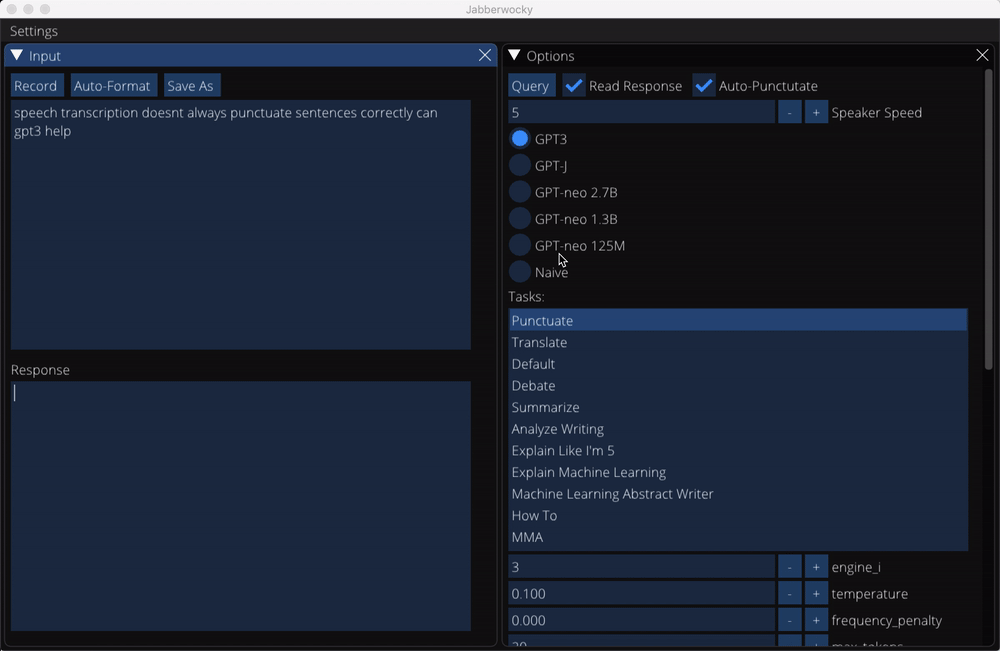

<p align='center'>

<h1 align='center'>Jabberwocky</h1>
</p>

| |
|-|
| Neil de Grasse Tyson discusses the state of science education. |
|<video src="https://user-images.githubusercontent.com/40480855/132139847-0d0014b9-022e-4684-80bf-d46031ca4763.mp4" width="400">|
|AI researcher and pocaster Lex Fridman discusses robot conceptions of intelligence.|
|<video src="https://user-images.githubusercontent.com/40480855/180587882-8eb0e689-86dd-48fe-9ce3-401c360771e8.mp4" width="400">|

    
# Project Description

This project provides two audio interfaces (a conversational alexa skill and a desktop GUI) to GPT-3 and a few of its open source variants. This provides a convenient way to interact with various experts or public figures, as mimicked by GPT-3: imagine discussing physics with Einstein or hip hop with Kanye. Instead of going to the OpenAI playground, writing a bio, and periodically deleting parts of your conversation as you exceed the max prompt window, you can simply say "Alexa, start Quick Chat"...

While the alexa skill is currently purely conversational, the GUI also provides Task Mode which contains built-in prompts for a number of sample tasks. It also supports generic GPT completions (i.e. no additional prompting is provided beyond what you say or type). I anticipate that further development will take place on the alexa skill but I don't plan to add to or actively maintain the GUI.


## Alexa Skill

### Quickstart

**This chat log provides a minimal example of the dialogue needed to launch the skill, start a conversation with a new contact, and exit the skill when done.**

> **User:** Alexa, start Quick Chat.<br>
> **Lou:** Hi there! Who would you like to speak to?<br>
> **User:** William Shakespeare<br>
> **Lou:** I don't see anyone named William Shakespeare in your contacts. Would you like to add a new contact?<br>
> **User:** Yes please.<br>
> **Lou:** I've connected you with William Shakespeare.<br>
> **User:** Hi William! I've been struggling with how to end my novel and I thought you could provide some input.

[User and William Shakespeare chat for a bit.]

...

> **User:** Thanks William! That really helped.<br>
> **William Shakespeare:** My pleasure.<br>
> **User:** Goodbye.

You can view more thorough documentation on setting up or using the skill in [alexa/README](alexa/README.md).

## GUI

### Quickstart

### Conversation Mode

In conversation mode, you can chat with a number of pre-defined personas or add new ones. New personas can be autogenerated or defined manually. 


See `data/conversation_personas` for examples of autogenerated prompts. You can likely achieve better results using custom prompts though.

Conversation mode only supports spoken input, though you can edit flawed transcriptions manually. Querying GPT-3 with nonsensical or ungrammatical text may negatively impact response quality.

### Task Mode

In task mode, you can ask GPT-3 to perform a number pre-defined tasks. Written and spoken input are both supported. By default, GPT-3's response is both typed out and read aloud.


Transcripts of responses from a small subset of non-conversation tasks can be found in the `data/completions` directory. You can also save your own completions while using the app.

## Dev Notes

### Project Members
* Harrison Mamin

### Repo Structure
```
jabberwocky/
├── lib          # Python package providing helpers for dealing with the openai api. Powers a lot of the functionality in both the GUI and alexa skill. Note that this also includes some other stuff that ultimately went unused - I initially experimented a bit with youtube transcripts, for example. Most useful functionality lives in the openai_utils module at this point.
├── alexa        # Code used to create a conversational alexa skill.
├── gui          # GUI scripts. The main script should be run from the project root directory. 
├── data         # Raw and processed data. Some files are excluded from github but the ones needed to run the app are there. This also includes miscellaneous gpt3 prompt files and conversational personas.
├── notes        # Miscellaneous notes from the development process stored as raw text files.
└── notebooks    # Jupyter notebooks for experimentation and exploratory analysis.
 
```

The `docker` and `setup` dirs contain remnants from previous attempts to package the app. While I ultimately decided to go with a simpler approach, I left them in the repo so I have the option of picking up where I left off if I decide to work on a new version.


